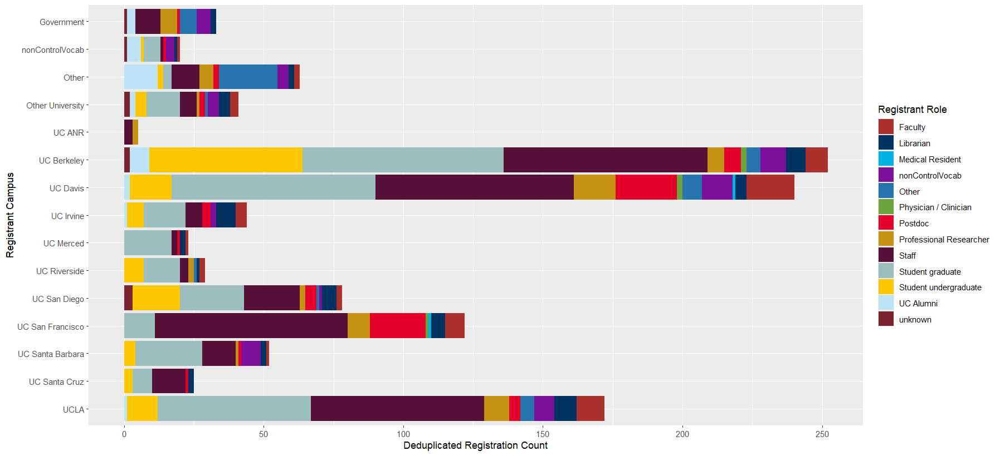

A quick look at attendance stats from UC Love Data Week 2024:

```{r}
## First some setup

## load libraries
library(readxl)
library(ggplot2)
library(forcats)
library(recolorize)
library(tidyverse)

## read in data
data <- read_excel("UCSFData.xlsx", sheet = "Workshops")
datarole <- read_excel("UCSFData.xlsx", sheet = "Roles")

```


UCSF was 4th in overall Event Attendance by Campus!



Most popular workshops for UCSF attendees:
```{r}
#order bar chart based on most workshop totals
data %>%
  mutate(Workshop = fct_reorder(Workshop, Total)) %>%
  ggplot( aes(x=Workshop, y=Total)) +
  geom_bar(stat="identity") +
  coord_flip()+
  geom_text(aes(label = Total), colour = "white", position = position_stack(vjust = 0.5), size = 3)
```


Workshop attendees by role:
```{r}
datarole %>%
  mutate(Role = fct_reorder(Role, Total)) %>%
  ggplot( aes(x=Role, y=Total)) +
  geom_bar(stat="identity") +
  coord_flip()+
  geom_text(aes(label = Total), colour = "white", position = position_stack(vjust = 0.5), size = 3)
```


